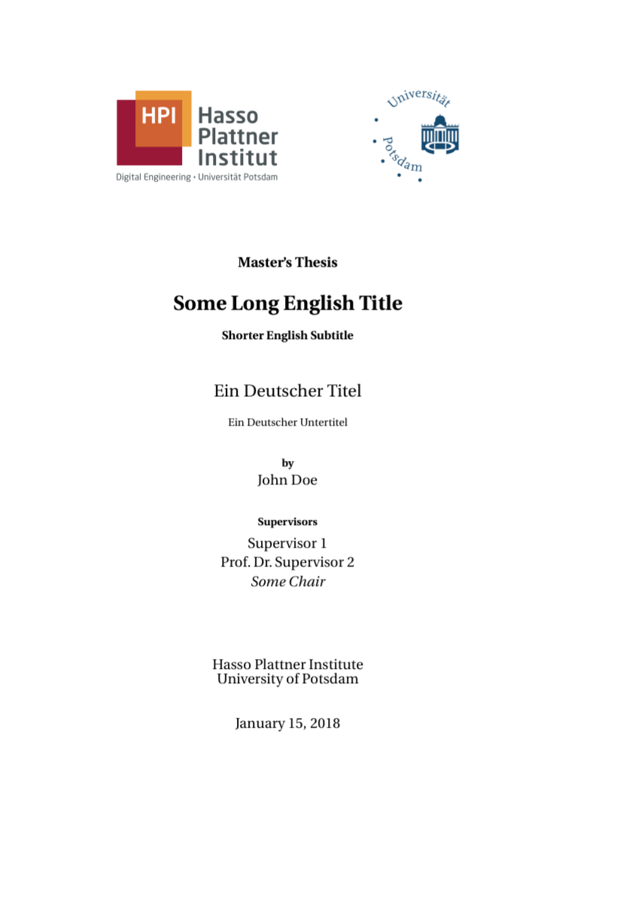

# HPI LaTeX Template

<!-- {:width="200px"} -->

This short LaTeX template was created from my master's thesis at HPI.
I hope it helps to get writing right away.

Feel free to adapt it in any way!

## Build
KOMA classes encourage you to have your title page separate from the actual document. You therefore need to build `titlepage.tex` first. The resulting PDF is then included in the thesis.